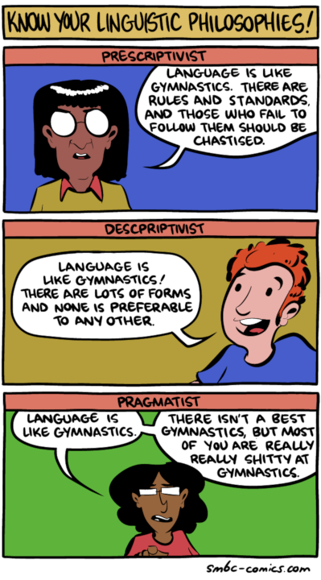

# Gregor's Prescription of Descriptivist Style

(Comic source: https://www.smbc-comics.com/comic/know-your-linguistic-philosophies )

I am a staunch linguistic descriptivist (or, if the above comic is to be
believed, perhaps I should claim to be a pragmatist). As such, I am generally
opposed to following style guides too precisely; they are to be used as guides,
not rules.  Here are the “rules” of descriptivist writing, according to me:

1. **Prescriptivists are bad people.** Common usage is the only valid arbiter
   of correct style. Do you have a copy of Strunk and White's *Elements of
   Style*? If so, burn it. If you can remember who gave it to you or told you
   to use it, burn them too. Many people argue that the utility of
   prescriptivism is “walk before you run”: you need to understand the rules
   before you bend or break them. The problem is that rules like (many of)
   Strunk's have absolutely no basis in English usage, so following Strunk is
   less “walk before you run” and more “hobble after I've broken your kneecaps
   for no reason before you walk”.

2. **Descriptivism is exactly what it says it is.** Most modern style guides
   try very hard to be descriptive: they describe what is common in English
   usage, and only *prescribe* rules when English usage is inconsistent, such
   as the distinction between en- and em-dashes, the Oxford comma, etc.
   Descriptivism is not “everything goes”, it's “usage dictates correctness”.
   Like every language, English has dialects and registers, and descriptivism
   integrates that, separately acknowledging British and American, formal and
   informal, etc., and their differences in common use. As this text relates to
   academic writing, I'm writing it in formal American English, and so follow
   the style of that dialect and register.

   A linguistic descriptivist acknowledges that language is alive, and
   atavism—particularly the fictional atavism advanced in many prescriptivist
   style guides—is not a valid rationale for stylistic decisions. Descriptive
   style guides, as long as they are honestly so, are useful as *guides*, but
   are still not *rules*. A good style guide should describe what is usual in
   English expression, not prescribe what is “correct”, and should change
   frequently to keep up with changing norms. If a style guide isn't on at
   least its fifth edition, it is highly suspect. A style guide which is “set
   in stone” is invalid.

3. **Clarity is king.** Writing is a form of communication, and the goal of
   most communication should be to convey meaning as clearly as possible.
   Grammar and style aid clarity: if your grammar is poor or inconsistent, then
   it's hard to parse your writing, and if it's hard to parse your writing,
   then your writing is unclear. The main reason to follow an established style
   at all is because clarity is aided by familiarity. But, *grammar and style
   are subservient to clarity, not superior to it.* If one form is clearer than
   another, then it is correct, no matter how many rules it breaks.

4. **Consistency is queen.** Whichever rules you follow and whichever rules you
   break, any given document should follow the same rules consistently.
   Inconsistency is needlessly distracting.

5. **Spoken English is English.** Written English should follow spoken English
   in almost all cases. Formal writing is distinct from informal writing, but
   only because formal *speech* is distinct from informal *speech*. You
   wouldn't use “ain't” or swearing in formal speech, so you shouldn't use them
   in formal writing. On the other hand, you probably would use “haven't”, or
   any other contraction, in formal speech, and so *should* use contractions in
   formal writing. Writing differs from speech because (a) English spelling is
   a nightmare from which anglophones cannot escape, (b) tone and nuance in
   speech must be clumsily represented by punctuation in writing, and (c), in a
   written work, one has the ability to use chapters, sections, references,
   figures, tables, illustrations, formulas, and such, which do not always have
   a meaningful equivalent in spoken English. Otherwise, the only valid excuse
   for the way you write something to be distinct from the way you would speak
   it is to eliminate ambiguity.

If you really want to know what my own rules are, I mostly follow the Chicago
Manual of Style, with the one exception that I steadfastly refuse to use
quotation marks in the absurd way that nearly all style guides recommend.
Punctuation belongs outside the quotation marks unless the punctuation is
actually part of the quote. But, that's just my own rule, and rules are made to
be broken.

Some commonly cited “rules” which specifically *ought to be broken*, because
they actively hinder clarity for no reason:

1. **~~Never write “s's”.~~** It's fine and correct to use “s's” so long as
   that is how you would say it, such as “Charles's friend”. When not
   pronounced, “s' ” is correct. Genitive (possessive) plurals are extremely
   inconsistent in common usage, and prescriptivism is a valid substitute when
   common usage isn't consistent, so it's “greengrocers' apostrophe”, not
   “greengrocers's apostrophe”. “Greengrocer's apostrophe” can also be correct,
   but is just genitive, not plural.

   If you prefer “s' ” in these cases for aesthetic reasons, that's fine. Just
   be consistent. But, know that this form, however aesthetic, actually hinders
   clarity, since it does not mirror speech.

2. **~~Whom.~~** Some pronouns have the same form as subjects and objects. Some
   don't. Nowadays, “who” does. Note that I actually do use “whom” in most
   circumstances, so I'm a hypocrite.

   “Whomever” is a revolting word which, like any other vulgarity, has no place
   in polite speech or writing.

3. **~~Less vs. fewer.~~** I have less than three eggs. I have fewer than three
   eggs. Use “fewer” if that's how you would have said it, but don't use it to
   satisfy pedants. “Less” has both meanings, and “fewer” has only one meaning.
   Using “less” consistently actually has the elegance of symmetry, as “more”
   is the opposite regardless.

4. **~~Active voice.~~** What style guide authors are, I assume, *trying* to
   convey in banishing the passive voice is that one should not “bury the
   lead”. In a CS paper, the form “the benchmarks were run on an Intel
   workstation” is correct, even though it is the passive form: the benchmarks
   are the critical detail here, and the passive formation is simply because of
   how the transitive verb “run” works. Rewriting it to the active “I/we ran
   the benchmarks on an Intel workstation” is the blithering of an egomaniac.
   On the other hand, “I/we implemented the benchmarks in JavaScript” is
   probably preferable to “the benchmarks were implemented in JavaScript”,
   because who implemented the benchmarks actually is important. Don't form
   your sentence in such a way that an important actor is elided; sometimes
   that means not using the passive form, but the sensible rule is not to bury
   the lead.

5. **~~Tense only for time.~~** In an academic research paper, the proper time of
   every aspect of the paper is “now”, so notionally, every reference within
   the paper could be written in the present tense. But, this is unhelpful.
   “This will be proved in section 3” and “this was proved in section 1” are
   helpful for keeping track in a front-to-back reading of a paper.

6. **~~Never start a sentence with a conjunction.~~** It is absolutely fine to
   start a sentence with “and”, “or”, or any other conjunction, so long as its
   meaning is clear from context.

7. **~~Don't split infinitives.~~** English writers have always been happy to
   breezily split infinitives. Strunk is a loon.

8. **~~Don't end a sentence with a preposition.~~** This is the kind of
   language up with which I cannot put.

9. **~~Don't use contractions.~~** Use contractions anywhere where you would
   use contractions in formal speech, so long as it doesn't create ambiguity.
   If you're unconvinced, I explain in much greater depth in [a separate
   document](CONTRACTIONS.md).

Some general guidelines (not rules!) for academic writing in Computer Science,
with some bias towards programming languages since that is my field:

1. **Separate concerns.** A CS work will often have both an element of design
   and an element of implementation, or equivalently an element of design and
   an element of proof. These should be separated as much as is possible.
   Consider a reader who wishes to reuse your contribution in a context as
   distinct from yours as it could be. They should be able to distill the
   useful, generalizable part of your contribution without needing to get
   bogged down by your particular implementation.

2. **Know your audience.** A paper submitted to a conference on JavaScript does
   not need to introduce any aspect of JavaScript, but a paper submitted to a
   journal on programming languages more generally does. Similarly, a paper
   submitted to a journal on programming languages doesn't need to define
   compilation, but may need to define Just-in-Time compilation. Give your work
   a full read, doing your best to take on the perspective of someone who knows
   nothing about your specific field.

3. **Don't use bad statistics.** A lot of CS papers give confidence intervals
   for things like benchmark results, but they're meaningless; confidence
   intervals are based on an assumption of a normal distribution, and most
   software performance does not have a normal distribution. Don't use the
   algebraic mean over the results of different evaluations. Don't give numbers
   if the reader has no basis for comparison; for instance, saying that your
   tool successfully analyzed 10,000 lines of code is not instructive if the
   reader doesn't know the total number of lines of code, or the number that
   failed.

4. **Avoid forward references.** It hinders readability to refer to a concept
   that will only be fully described in a later section. Note that a
   superficial description in the introduction is not sufficient. Sometimes
   forward references are unavoidable, but you should only allow a forward
   reference after exhausting all other possible options. It is usually
   possible to rearrange things to avoid forward references entirely.

5. **Make it clear when you're defining a new term.** Many works italicize new
   terms, which is a good style to follow, but it's not mandatory. What's
   important is to make clear when a term is new, so that a reader immediately
   knows that they should not be familiar with it, and aren't simply ignorant
   of it. A term introduced in the introduction of a work should not be
   considered as already-introduced later in the work. The first introduction
   of a term within the main body of the work is where the term is actually
   defined.

6. **More examples.** Use running examples. Use momentary examples. Use
   examples of specific exceptional cases. Use examples of general cases. Use
   examples of previous systems to compare them to examples of yours. The right
   number of examples is “more”.

7. **Blind means blind.** It is worth following a style guide simply to avoid
   forming an identifiable style that will effectively unblind your blind
   submissions. Of course, everyone writes in their own style, so to a certain
   extent this is unavoidable, but one should nonetheless aim for
   non-identifiable style to whatever degree that's possible. All blind paper
   submissions should use American English unless they are specifically
   submitted to a British, Australian, or New Zealand conference, and singular
   works should use “we”, never “I”.

8. **Follow mandated style.** Some publishers have mandated style guides. More
   often than not they dictate things like line spacing and typeface, rather
   than writing style, but sometimes they do a bit of both. If you're
   submitting to a publisher with a specifically mandated style guide,
   obviously you should follow it. Don't break the rules just to be a rebel.
